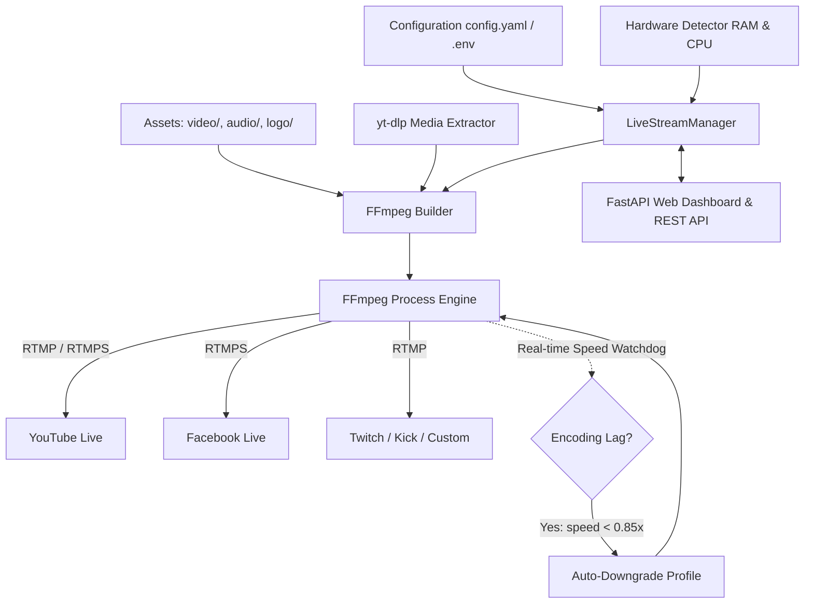

<div align="center">

# 🎬 YT_LIVE: 24/7 Multi-Platform Live Broadcast Engine

**Enterprise-grade, adaptive 24/7 live streaming system for YouTube Live, Facebook Live, Twitch, Kick & Custom RTMP servers.**

[](https://www.python.org/)
[](https://ffmpeg.org/)
[](https://fastapi.tiangolo.com/)
[](https://www.docker.com/)
[](LICENSE)
[](https://github.com/shubhamkumarjha)

<p align="center">
  <a href="#-key-features">Key Features</a> •
  <a href="#-architecture">Architecture</a> •
  <a href="#-directory-structure">Directory Structure</a> •
  <a href="#-quickstart-guide">Quickstart</a> •
  <a href="#-streaming-modes">Streaming Modes</a> •
  <a href="#-adaptive-hardware-engine">Adaptive Hardware</a> •
  <a href="#-watermark-overlay">Watermark Overlay</a> •
  <a href="#-web-dashboard--rest-api">Web Dashboard</a> •
  <a href="#-247-production-deployment">24/7 Deployment</a> •
  <a href="#-license">License</a>
</p>

---

</div>

## 🌟 Key Features

- **🚀 5 Powerful Streaming Modes**:
  1. **Radio Looper**: Infinite video background loop with online YouTube audio stream or playlist.
  2. **YouTube Video/Stream Restreamer**: Directly relay any live broadcast or video to your target channel.
  3. **Custom Media Combiner**: Mix any custom remote or local video source with any custom audio source.
  4. **Local Playlist 24/7 Looper**: Continuous, seamless looping through a folder of videos and audio tracks.
  5. **Direct Stream Relay**: Restream HLS (`.m3u8`), RTMP, or RTSP camera feeds directly.
- **🌐 Multi-Platform Broadcast**:
  - Seamlessly stream to **YouTube Live**, **Facebook Live (RTMPS)**, **Twitch**, **Kick**, or any **Custom RTMP/RTMPS** destination.
- **🛡️ Adaptive Hardware Engine (Runs on 500MB RAM & 0.1 vCPU)**:
  - Automatically inspects available system memory (including Docker/cgroup limits) and CPU cores.
  - Features real-time encoding speed watchdog: if FFmpeg lags (`speed < 0.85x`), the engine automatically downgrades the stream profile (e.g. 1080p → 720p → 480p → 240p ultrafast) to **guarantee zero stream crashes, buffering, or dropped frames**.
- **🎨 Real-Time Vector SVG & PNG Watermark Overlay**:
  - Overlay your brand logo or animated live badge dynamically with customizable position (`top-right`, `top-left`, etc.), opacity, and intelligent auto-scaling.
- **🔄 24/7 Resilience & Auto-Healing**:
  - Auto-reconnect with exponential backoff on internet drops or RTMP reset.
  - Automatically refreshes expiring YouTube CDN tokens to prevent stream interruption during multi-day broadcasts.
  - Graceful shutdown handling (`SIGINT`/`SIGTERM`) to cleanly finalize streams without zombie processes.
- **💻 Dual Interface**:
  - **Interactive CLI Wizard**: Terminal UI with hardware diagnostics and mode picker.
  - **Modern Web Dashboard & REST API**: Live status monitoring, start/stop buttons, mode switcher, and Swagger API documentation.

---

## 🏗️ Architecture



---

## 📁 Directory Structure

```
YT_LIVE/
├── audio/                      # Audio assets and playlist configurations
│   ├── audio.txt               # Audio URLs playlist (YouTube links, radio streams)
│   └── README.md               # Audio formats, bitrate, and configuration guide
├── video/                      # Video assets and looping backgrounds
│   ├── vid.mp4                 # Default looping background video
│   └── README.md               # Video specifications and encoding recommendations
├── logo/                       # Watermark graphics (vector SVG & raster PNG)
│   ├── logo.svg                # Vector broadcast badge with live pulse indicator
│   └── README.md               # Watermark positioning, scaling, and opacity guide
├── core/                       # Modular engine core
│   ├── __init__.py             # Package init & version metadata
│   ├── config.py               # YAML & Environment variable configuration loader
│   ├── extractor.py            # yt-dlp stream extraction & token refresh
│   ├── hardware.py             # Hardware detection & adaptive quality engine
│   ├── ffmpeg_builder.py       # FFmpeg command builder & overlay filtergraphs
│   ├── streamer.py             # 24/7 stream lifecycle & resilience watchdog
│   └── api.py                  # FastAPI controller & interactive Web Dashboard
├── config.yaml                 # Central configuration file
├── .env.example                # Environment variable template
├── main.py                     # Unified entry point (Interactive CLI + API + Headless)
├── upload.py                   # Automated video download & chunked upload scheduler
├── requirements.txt            # Python production dependencies
├── pyproject.toml              # Modern Python packaging specification
├── Dockerfile                  # Production container definition (with FFmpeg & librsvg)
├── docker-compose.yml          # Container orchestration configuration
├── LICENSE                     # MIT License (Shubham Kumar Jha)
└── README.md                   # Complete documentation
```

---

## ⚡ Quickstart Guide

### Prerequisites
- **Python**: Version 3.9 or newer (`python3 --version`)
- **FFmpeg**: Installed with H.264 encoder support (`ffmpeg -version`)

```bash
# Ubuntu / Debian
sudo apt update && sudo apt install -y ffmpeg librsvg2-bin

# Arch Linux / Manjaro
sudo pacman -S ffmpeg librsvg

# macOS (Homebrew)
brew install ffmpeg librsvg
```

### Installation

1. **Clone the repository**:
   ```bash
   git clone https://github.com/shubhamkumarjha/YT_LIVE.git
   cd YT_LIVE
   ```

2. **Install Python dependencies**:
   ```bash
   pip install -r requirements.txt
   ```

3. **Configure your Stream Key**:
   Set your stream key in `config.yaml` or create a `.env` file:
   ```bash
   cp .env.example .env
   # Edit .env with your favorite editor
   nano .env
   ```

4. **Launch YT_LIVE**:
   ```bash
   # Launch with interactive wizard
   python main.py

   # Or launch directly in background with Web Dashboard
   python main.py --mode 1 --platform youtube
   ```

   Visit the Web Dashboard at: **`http://localhost:8000`**

---

## 🎮 Streaming Modes

### Mode 1: Radio Looper (Looping Video + Audio Playlist)
Takes a looping video from `video/vid.mp4` and streams an audio playlist from `audio/audio.txt` or a direct YouTube URL.
```bash
python main.py --mode 1 --video video/vid.mp4 --audio audio/audio.txt
```

### Mode 2: YouTube Video or Live Stream Relay (Restream)
Takes any active YouTube live stream or recorded video and relays it directly to your target channel with your watermark logo.
```bash
python main.py --mode 2 --yt-source "https://www.youtube.com/watch?v=jfKfPfyJRdk"
```

### Mode 3: Custom Media Combiner
Combine any video source (local file or direct MP4 URL) with any audio source (local file or audio stream).
```bash
python main.py --mode 3 --video "https://example.com/video.mp4" --audio "https://example.com/stream.mp3"
```

### Mode 4: Local Playlist 24/7 Looper
Loops through all video clips in `video/` and audio files in `audio/` continuously.
```bash
python main.py --mode 4
```

### Mode 5: Direct Stream Relay
Restream an external HLS (`.m3u8`) or RTMP feed to YouTube or Facebook Live with your branding.
```bash
python main.py --mode 5 --video "https://example.com/live/playlist.m3u8"
```

---

## 🌐 Multi-Platform Broadcast Setup

### 1. YouTube Live
```yaml
destination:
  platform: "youtube"
  stream_key: "your-youtube-stream-key"
```
Or via CLI:
```bash
python main.py --platform youtube --stream-key "xxxx-xxxx-xxxx-xxxx"
```

### 2. Facebook Live
Facebook Live uses secure **RTMPS**. YT_LIVE handles this natively:
```yaml
destination:
  platform: "facebook"
  stream_key: "your-fb-stream-key"
```
Or via CLI:
```bash
python main.py --platform facebook --stream-key "FB-xxxxxxxxx"
```

### 3. Custom RTMP / RTMPS Server
```bash
python main.py --platform custom --custom-rtmp "rtmp://my-server.com/live/my-stream-key"
```

---

## 🛡️ Adaptive Hardware Engine

YT_LIVE is engineered to run seamlessly across all hardware classes—from **$2.50 budget cloud VPS (512MB RAM, 0.1 vCPU)** up to dedicated 16-core broadcast rigs.

### Quality Profile Ladder

| Profile | Target Hardware | Resolution | FPS | Video Bitrate | Audio Bitrate | Threads |
| :--- | :--- | :--- | :--- | :--- | :--- | :--- |
| **`ultra_low`** | 500MB–1GB RAM, 0.1–0.5 vCPU | 426x240 | 15 | 250 kbps | 64 kbps | 1 |
| **`low`** | 1GB–2GB RAM, 1 vCPU | 854x480 | 24 | 800 kbps | 96 kbps | 2 |
| **`medium`** | 2GB–4GB RAM, 2 vCPUs | 1280x720 | 30 | 2500 kbps | 128 kbps | Auto |
| **`high`** | 4GB+ RAM, 4+ vCPUs / GPU | 1920x1080 | 30 | 4500 kbps | 160 kbps | Auto |

### Automatic Speed Watchdog & Auto-Downgrade
When `auto_downgrade_on_lag: true` is enabled (default), the stream manager monitors FFmpeg encoding speed in real-time. If the host machine CPU spikes and speed drops below `0.85x`, the engine automatically restarts the stream on the next lower profile tier without dropping the broadcast.

To manually pin a quality profile:
```bash
python main.py --quality ultra_low
```

---

## 🎨 Watermark / Logo Overlay

Add your channel branding, vector SVG badges, or sponsor logos over the live stream:

```yaml
overlay:
  enable: true
  logo_path: "logo/logo.svg"    # Supports .svg, .png, .jpg
  position: "top-right"         # top-right, top-left, bottom-right, bottom-left, center
  margin_x: 24                  # Pixels from horizontal edge
  margin_y: 24                  # Pixels from vertical edge
  scale_width: 200              # Width in pixels (-1 for native)
  opacity: 0.92                 # 0.1 (transparent) to 1.0 (opaque)
```

CLI Override:
```bash
python main.py --logo logo/logo.svg --logo-pos top-right
```
To disable overlay entirely:
```bash
python main.py --no-overlay
```

---

## 🖥️ Web Dashboard & REST API

The built-in FastAPI controller provides a clean web UI and programmable REST endpoints.

| Method | Endpoint | Description |
| :--- | :--- | :--- |
| `GET` | `/` | Interactive Web Dashboard with real-time controls |
| `GET` | `/status` | Real-time JSON telemetry (uptime, active mode, hardware, PID) |
| `GET` | `/hardware` | System RAM, CPU cores, and recommended profile report |
| `POST` | `/start` | Start live streaming with optional mode/platform overrides |
| `POST` | `/stop` | Stop live streaming immediately |
| `POST` | `/switch-mode`| Switch streaming mode on the fly |
| `POST` | `/set-quality`| Dynamically change active quality profile (`ultra_low`, `low`, etc.) |
| `GET` | `/logs` | Fetch the last 100 log lines from the active stream |
| `GET` | `/health` | Healthcheck endpoint for Docker / Kubernetes |
| `GET` | `/docs` | Interactive Swagger API documentation & tester |

---

## 🚀 24/7 Production Deployment

### Option A: Systemd Service (Linux Server)

Create a systemd unit file at `/etc/systemd/system/yt-live.service`:
```ini
[Unit]
Description=YT_LIVE 24/7 Live Broadcast Service
After=network.target

[Service]
Type=simple
User=ubuntu
WorkingDirectory=/home/ubuntu/YT_LIVE
Environment="PATH=/home/ubuntu/YT_LIVE/venv/bin:/usr/local/bin:/usr/bin"
ExecStart=/usr/bin/python3 /home/ubuntu/YT_LIVE/main.py
Restart=always
RestartSec=5
LimitNOFILE=65536

[Install]
WantedBy=multi-user.target
```

Enable and start the service:
```bash
sudo systemctl daemon-reload
sudo systemctl enable yt-live
sudo systemctl start yt-live
sudo systemctl status yt-live
```

### Option B: Docker & Docker Compose

Deploy with a single command:
```bash
docker compose up -d
```

Check container logs:
```bash
docker compose logs -f
```

---

## ❓ Troubleshooting & FAQs

<details>
<summary><b>1. YouTube bot detection or "Sign in to confirm you're not a bot" error</b></summary>
Export your cookies from your browser using an extension like <i>Get cookies.txt LOCALLY</i> and save the file as <code>cookies.txt</code> in the root directory. yt-dlp will automatically load it.
</details>

<details>
<summary><b>2. Low CPU VPS is lagging or dropping frames</b></summary>
Run with the <code>--quality ultra_low</code> flag or set <code>quality_profile: "ultra_low"</code> in <code>config.yaml</code>. This configures FFmpeg to use 240p with 1 CPU thread and minimal buffer.
</details>

<details>
<summary><b>3. How do I stream to both YouTube and Facebook at the same time?</b></summary>
You can run two instances of YT_LIVE using different ports:
```bash
python main.py --platform youtube --port 8000 &
python main.py --platform facebook --port 8001 &
```
</details>

---

## 📄 License & Credits

This project is licensed under the **MIT License** - see the [LICENSE](LICENSE) file for details.

- **Author**: [Shubham Kumar Jha](https://github.com/shubhamkumarjha)
- **Engine**: FFmpeg, yt-dlp, FastAPI, Uvicorn
